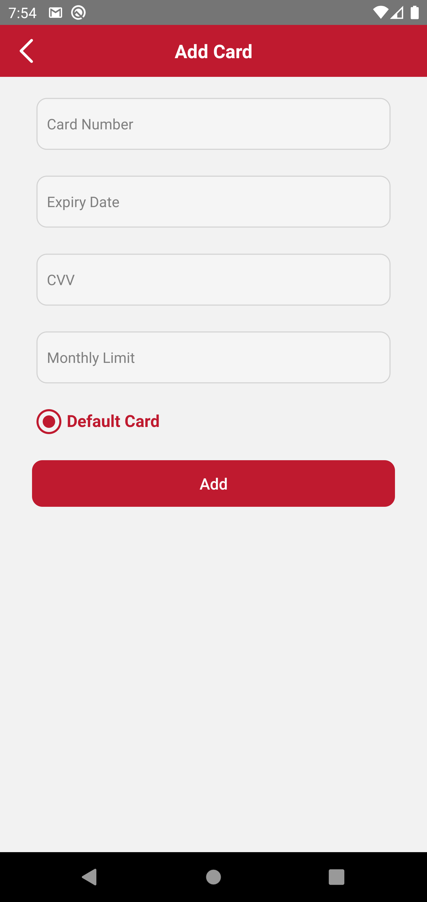
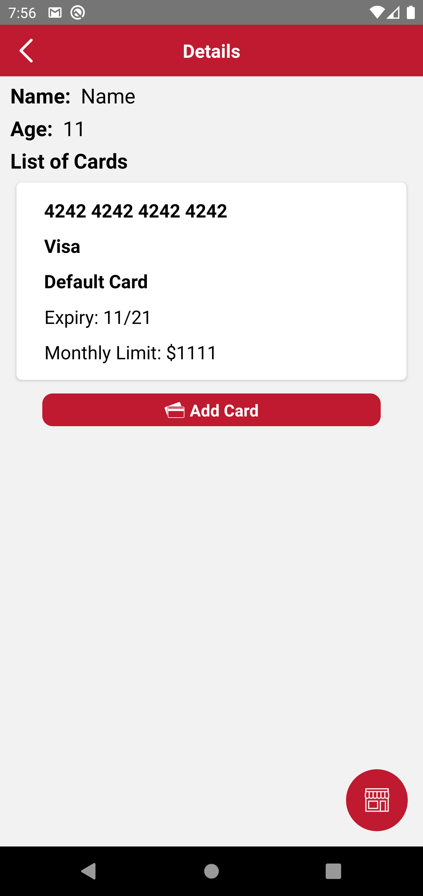
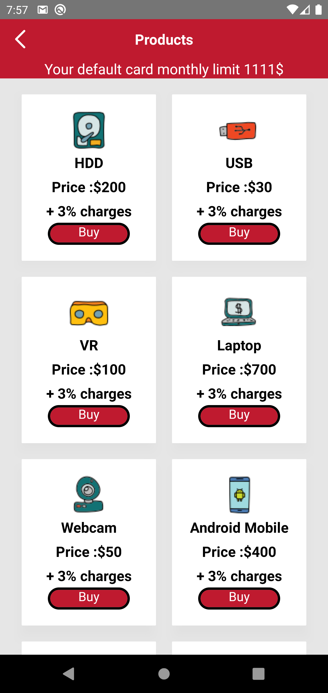

#Credit 

Credit is the app used to manage the Credit card for the children 


<p float="left">
  
  
  
  
  
  
  
  
  
  
</p>

## About The Project
The Project is about a parent can add credit or debit card and they can add with specific monthly limit to the Children for their usage

### Built With

* [React-Native](https://reactnative.dev)
* [Javascript](https://www.javascript.com)


## Getting Started

This is an example of how you may give instructions on setting up your project locally.
To get a local copy up and running follow these simple example steps.

### Prerequisites

This is an example of how to list things you need to use the software and how to install them.
* npm
  ```sh
  npm install 
  ```
* yarn
  ```sh
  yarn install 
### Installation

1. Clone the repo
   ```sh
   git clone https://github.com/kumaransoftsuave/testproject.git
   ```
1. Install packages using NPM or YARN
   ```sh
   npm install
   ```
* yarn
  ```sh
  yarn install 
   ```

## Test card
 These are the cards are allowed to get added for the children

4242 4242 4242 4242

4000 0566 5566 5556

5555 5555 5555 4444

3782 8224 6310 005


## Roadmap

See the [open issues](https://github.com/kumaransoftsuave/testproject/issues) for a list of proposed features (and known issues).


